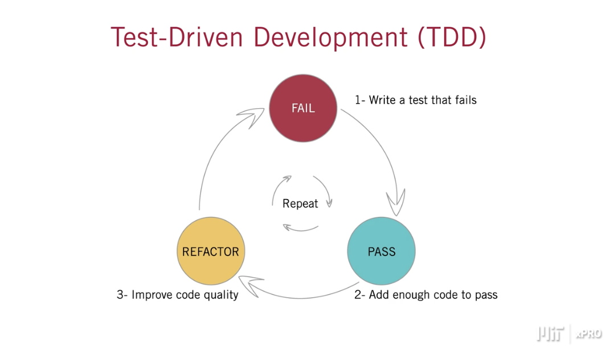

# week-20
## MIT xPro Week 20 - Testing

In Module 20: Testing, you’ll learn how to build, deploy, and test a React application. You’ll deploy a static website with Amazon Web Services. You’ll learn how to use GraphQL to specify the API data that your front end receives. Finally, you’ll test user events and dependencies with Jest. It is important to practice these new skills as you finalize your Front-End Banking Application GitHub Portfolio project, which is due at the end of the portfolio project module.

1. Deploy a static website to the cloud
2. Identify REST principles for an API
3. Define a static website
4. Identify the role of GraphQL 
5. Identify the role of Create React App
6. Refactor unit tests within Create React App
7. Test input data with Jest 
8. Write a unit test with a mock API
9. Implement GraphQL to return a selected  piece of data to the shopping cart application
10. Integrate a GraphQL API with a Strapi database

[Create React App](https://reactjs.org/docs/create-a-new-react-app.html)

[Amazon Web Services](https://aws.amazon.com/s3/)

[What Is AWS?](https://aws.amazon.com/what-is-aws/?nc1=f_cc)

[What Is Cloud Computing?](https://aws.amazon.com/what-is-cloud-computing/?nc1=f_cc)

[Amazon Simple Storage Service Documentation](https://docs.aws.amazon.com/s3/index.html)

[AWS Developer Center](https://aws.amazon.com/developer/?nc1=f_dr&developer-center-activities-cards.sort-by=item.additionalFields.startDateTime&developer-center-activities-cards.sort-order=asc)

[GraphQL](https://graphql.org)

[GraphQL Community](https://graphql.org/community/)

[Jest](https://jestjs.io)

[Getting Started With Jest](https://jestjs.io/docs/getting-started)

[Jest: An Async Example](https://jestjs.io/docs/tutorial-async)

[JavaScript Testing Tutorial: Mocking API Calls](https://wanago.io/2018/09/17/javascript-testing-tutorial-part-four-mocking-api-calls-and-simulating-react-components-interactions/)

# My Bugs

1. Video 20-14.

No error with this.

```expect(root.querySelector('label').textContent).toBe('add todo');```

Error with this. What is form control?

```expect(getByLabelText('Add todo')).not.toBeNull();```

```TestingLibraryElementError: Found a label with the text of: add todo, however no form control was found associated to that label. Make sure you're using the "for" attribute or "aria-labelledby" attribute correctly.```

Solution: The iput ID must match the htmlFor="new-todo"

```id="new-todo"```


## Creat React App

### Video 20.1 Introdeuction to Create React App

React Command Line Interface: Craete a whole project

```npx create-react-app``` To create a project folder with sub-folders and skeleton files with standard nameing conventions.

Create React App

In the course so far, you’ve created React applications from scratch. Now, you’ll learn about a tool that comes with a configuration and a scripts command that makes it much easier to build React applications: [Create React App](https://github.com/facebook/create-react-app)

A script is a set of instructions that tells a program what to do. In React, scripts help turn JSX into plain JavaScript code that can be interpreted by all browsers.  They are located in the ```package.json``` file, which has some default scripts that you can edit.

Popular Create React App Scripts

Create React App dramatically streamlines the React development process and it ships with a few scripts.

- Start: React uses Node.js on development to open the app on http://localhost:3000. The npm start script enables you to start the server and display the latest version of the app each time a change occurs, as well as any code errors. 
- Build: React is modular, so there are several files or components within a single application. The npm build script bundles these components into one single file so they can be deployed. It also aids in performance; React uses the build script to ensure that the finished project is minified and optimized with best practices.
- Test: Create React App uses Jest as a test runner. The npm test script enables you to launch the test runner in interactive watch mode.

Not only does Create React App come with useful scripts that can help make any developer’s life easier but also some commands with flexible options that will enable you to fit the scripts to the unique needs of your project.

### Video 20.2 Istall Create React App

Learn how to install Create React App in your local directory. Using Create React App will help you prepare files for deployment to the cloud. Go through the bundle of files that are created when you use Create React App.

```npx create-react-app mydirectory``` Creates the app directory.

```npm start``` Starts the development server.

```npm run build``` Bundles the app into static files for production.

```npm test``` Starts the test runner.

```npm run eject``` Removes this tool and copies build dependencies, configuration files and scripts into the app directory.

1. Install cartsoln01 is the directory name that will be created ```npx create-react-app cartsoln01```

2. Start the development server ```npm start```

3. Files in the app
- node_modules
- public: public images that are used
- src: Source files
     - index.js renders to DOM
     - app.js is the main component and starting point
          - loads an image src={logo} from the public directory
          - Link <a> Let's Learn React </a>

4. Make a change to the link text to see how the DOM reacts. Change the text and save. The app is watching for changes and the DOM reloads automatically.

### NPM Scripts for React

### Video 20.3 Create React App - Shopping Cart Example

Align it to the Create React App structure. Use the week-19 shopping cart.

1. Create a components directory inside the source(SCR) directory.

2. Create products.jsx and paste cart.jsx script.

3. Get imports into products.js.

```import React from "react";```

```Import ReactBootstrap from "react-bootstrap";```

```import axios from "axios";```

4. Load react-bootstrap, axios and bootstrap from terminal.

```npm install react-bootstrap```

```npm install axios```

```npm install bootstrap```

5. Remove render command from products.js. Rendering happens in the App component.

6. Move bootstrap components to global scope and import.

```
import {
    Card,
    Accordion,
    Button,
    Container,
    Row,
    Col,
    Image,
    Input,
  } from `react-bootstrap`;
```

7. In the App return tags, replace contents with Products component which is imported from products.js.

```import Products from "./Components/products"``` assumes Components folder is inside src folder.

```<Products></Products>```

8. In the products.js, export Products component.

```export default Products;```

9. In index.js, import bootstrap which was installed in step 4.

```import "bootstrap/dist/css/bootstrap.css";```

### Video 20.4 Build Static Website

Once a static website is deployed, it doesn’t continue to interact with the web server. This is because static websites deliver the same content to all users. Build a static website so it can be deployed to the cloud.

```http-server -c1-1``` For the week-19 Shoping Cart use Port 8080: launches a stand alone server that functions as a static website. No more interaction back to the server. Just one communication with terminal to download the website.

```npm start``` Port 3000: for week-20 create-react-app. In DevTools:
- Network tab to see files dowloading. Nothing happening when buttons are clicked. Why?
- Elements tab to see the 'root' container, 3 'rows', Cart with accordian and 3 cards representing the cart contents. The card element disappears when the card is removed in the DOM. All this communication is done on the browser without communication to the web server, which you can by looking at the Network traffic.

```npm run build``` to make a static website. It automatically creates a directory called build. Run an 

```npx http-server``` inside the build directory. This will hit the index by default. This makes it more difficult for hackers.

```ls``` to list the files and copy all the files to deploy to the cloud.

### Video 20-5 Introduction to Deployment

Deploy to an S3 bucket on [Amazon Web Services](https://aws.amazon.com/s3/).

### Introduction to Cloud Computing and Amazon Web Services

What is cloud computing?
Before cloud computing was available, every person who wanted to launch an application on the internet needed their own physical server. This was costly and complex.

Now, with cloud computing, an individual can utilize computers and servers over the internet. Providers such as Amazon’s AWS or Microsoft’s Azure offer you the option to rent space on a server that you don’t have to manage physically, so you can deploy your application to the cloud. It’s important for you to get familiar with the different aspects of cloud computing and cloud services.

- What is AWS?

Amazon Web Services (AWS) is the world's most comprehensive and broadly adopted cloud platform, offering over 200 fully featured services from data centers globally. It is a secure cloud services platform, offering computing power, database storage, content delivery, and other functionality to help businesses scale. 

AWS runs web and application servers in the cloud which host dynamic websites. AWS allows you to select your desired solutions while you pay only for the services you consume.

In this course, you will use AWS to host your React application. This will allow anyone on the internet to view your application by entering the URL. To accomplish this, you can deploy your application into an AWS S3 bucket.

- What is AWS S3?

An AWS S3 bucket or Amazon Web Simple Storage Service allows you to store and retrieve any amount of data, at any time, from anywhere on the web. S3 buckets are similar to file folders: They store objects that consist of data and its descriptive metadata.

To create an AWS account, follow the instructions outlined in the official [AWS documentation](https://aws.amazon.com/premiumsupport/knowledge-center/create-and-activate-aws-account/).

To set up an S3 bucket within your AWS account, follow the instructions outlined in the official [AWS documentation](https://docs.aws.amazon.com/AmazonS3/latest/userguide/create-bucket-overview.html).

### Video 20-6 Deploy Static Website on AWS3

Deploy your static website to Amazon Web Services (AWS). Deploy your Front-End Banking Application GitHub Portfolio project in order to submit it so you can consider using that project to follow along. Whether you have created your application like Dr. Sanchez as React standalone or refactored it with create-react-app, you can follow the instructions below to deploy it to an S3 bucket. The same rules still apply, you have to upload all your application files to the bucket and make it publicly accessible.

1. Build the static website with command shown in Video 20.4. These files will be uploaded to the S3 bucket.

2. Create an S3 bucket on AWS. Create account and creat S3 bucket instructions are provided in the links above. 

3. S3 Bucket Policy publicly accessible by following these steps: 
- Go to your S3 bucket and locate the “Permissions” tab
- Once on that tab, scroll down to the “Bucket Policy” section and click “edit”. Unselect ```Block Public Access```
- Paste the following JSON into the box, making sure you change

FIRSTNAME_LASTNAMEBANKINGAPP to your actual bucket name:

```
{

    "Version": "2008-10-17",

    "Statement": [

        {

            "Sid": "AllowPublicRead",

            "Effect": "Allow",

            "Principal": {

                "AWS": "*"

            },

            "Action": "s3:GetObject",

            "Resource": "arn:aws:s3:::FIRSTNAME_LASTNAMEBANKINGAPP/*"

        }

    ]

}
```

This isn't going to work. I had to set up an IAM user with administrator authorizations. The getting started instructions will get you there.  [Getting Started with AWS](https://aws.amazon.com/getting-started/)

4. S3 Properties: Static Web Hostion
- Select ```Use this bucket to host a website```
- Type index document in the build folder```index.html```

5. S3 Objects: Upload all files and folders from the build directory.

6. Click on the index.html file to find the object URL. This is your website! The restock cart function does not connect to strapi...yet.

6. Another option for hosting a website is to go through github. See below.

[Host a Static Website](aws.amazon.com/getting-started/hands-on/host-static-website/)

url for alias ```https://astros2017.signin.aws.amazon.com/console```

## APIs

### Rest Principles and RESTful API

Representational state transfer (REST) is a standard for communication between an application’s server and its client. It is considered the industry-standard protocol for web APIs, so you will likely answer questions about REST during software development interviews. It’s important to understand that REST is not a technology or framework; it’s an architectural style to support any API design. 

RESTful APIs adhere to these five principles.

1.Contract-first approach / Uniform Resource Identifiers
The “contract” in the Contract-first approach refers to a contract between your client application and the server. The client app needs to know that it can call the API endpoint and get the data in the expected format each time.

Contract Example:

Let’s suppose you had a server with the endpoint “/api/v1/orders/14829/status” that returned the status of order number `14829.` As a RESTful API, the client would expect that:

The API endpoint does not change
The data format does not change
The API documentation describes what information is stored and how

2. Statelessness

The client application should assume that the server did not preserve the state from previous API calls. The client application should provide all the information necessary for the server to respond to each call. What does this mean? 

Say you (the client application) asked your neighbor (the server application) about a mutual friend. In a real-life conversation, the following questions would be stateful:

How old is Frank Gibson? What does he do for work?

You (the client application) expect your neighbor (the server application) to remember the mutual friend’s name. So, the second question assumes that the question is about Frank Gibson.

In a RESTful API, the same conversation between the client and server applications would instead go like this:

How old is Frank Gibson?

What does Frank Gibson do for work?

The client provides all the information a server needs to respond to every API call, assuming that the server remembers nothing of the previous API calls.

3. Client-server Model
The client application doesn’t care about how the server stores the data or the technology used. The only thing it cares about is the database schema which contains a description of the stored data and the layout in which it is stored.

4. Caching
Caching is the temporary storage of information outside the server. The client can cache data locally to have it available without making an additional API call. 

5. Layered architecture
When you have a client application that calls an API endpoint that triggers logic on your back-end server application, you have a layered architecture. What’s important in REST is that each layer only knows about the layer next to it and no more. This is also called a separation-of-concerns. Each layer has a specific job and passes information to and from its neighboring layers to get the job done. Thus, the only layer that the client application knows about is the API, which is its immediate neighbor; it does not know about any other layers beyond the API.

### Video 20-7 Introduction to GraphQL

- This is an important tool for getting data from remote websites and databases.

[GraphQL](https://graphql.org) improves upon the REST principles for APIs. GraphQL allows the front end to specify the data that is returned, unlike REST which returns all of the data. You’ll learn more about GraphQL on the next page and then you'll practice using it.

Strapi builds a really good API using REST principles of architecture. When request data using REST, it returns some extra data that we don't need resulting in long response times. GraphQL solves this problem by useing a POST and quert to specify the data we want. It is a back-end tools that affects the front end.

### What is GraphQL?

GraphQL is a query language for APIs, an alternative to REST that gives clients the power to ask for the data they need and nothing more. 

If GraphQL is a query language, does that mean it’s a database?

GraphQL is often confused as database technology, but it is a query language for APIs, not databases. This makes it database agnostic, meaning GraphQL can be used with any top database option.

GraphQL vs REST

In a standard RESTful API, you typically hit an endpoint that determines what data is returned. GraphQL improves upon the REST philosophy by allowing the front-end application to ask for a specific piece of that data.

Let's say you want to display the logged-in user's email address on their profile page.

To do this with a REST API, you would:

- Call an “auth/user” endpoint and get all of the user's information. 
- Pull the email address out of that returned data 
- Display the email address

Issues with REST:

- If the logged-in user has many data associated with it, such as a list of events, order history, addresses, and phone numbers, it will all be returned even if you don’t need this information.
- Unnecessary information is passed around. 

GraphQL allows you to query only the data you want. If you replace the REST endpoint with a GraphQL one, you could query the currently logged-in user but specify you only want their email address.
```
{
user {
  emailAddress
}
}
```

### Video 20-8 GraphQL Demo

REST APIs often return data that you don’t need. GraphQL returns only selected information. You can practice using GraphQL with Strapi and Postman through the shopping cart exercise from week-19. Remember that postman is an Application that is downloaded to your computer. Going to the Postman website doesn't work.

In postman ==> body select GraphQL and then use the GraphQL dropdown to select GraphQL. Also, the strapi database needs to allow graphQL.

Introduction

In this assignment, you’ll create a restaurant database and GraphQL API using Strapi. This assignment uses Strapi v3, which requires that you use node v14 and npm v6.

If you need a review of Strapi, refer to the following activity: Create Strapi Database Activity. 

Restaurants Collection

Initialize Strapi

First, you’ll need to open a terminal and create a directory for the project. This is where you will create the Strapi project.

1. Create the restaurants database. Run the following command.
```npx create-strapi-app@3 restaurants --quickstart```

*Note: if you encounter errors, you can run npx 
```npx create-strapi-app@latest my-project --quickstart```

2. Wait for the application to initialize. It will open a tab in your web browser.

3. Register an admin account with the Strapi user interface.

Create Restaurants Collection

Now that Strapi is running, create a restaurant collection with the following fields: ID, name, description, and photo. The ID field will be created automatically.

Create the database.
- On the right-hand side navigation pane, select Content-Types Builder.
- Under Collection Types, select + Create New Collection Type.
- Enter “restaurants” as the display name, “restaurant” as the API ID (singular) and “restaurants” as the API ID (plural). 
- Select Continue.

Create the Name field.
- Choose Text as the field type.
- Enter “name” as the field name.
- Under Type, select Short Text.
- Select + Add another field.

Create the Description field.
- Choose Text as the field type.
- Enter “description” as the field name.
- Under Type, select Long Text.
- Select + Add another field.
- Create the Photo field.

Choose Media as the field type.
- Enter “photo” as the field name.
- Under Type, select Single Media.
- Select Finish.

Save the collection.
- Select the Save button.

Strapi and GraphQL

To use GraphQL, you will need to install it via npm.

Refer to the Strapi [documentation](https://docs.strapi.io/developer-docs/latest/plugins/plugins-intro.html) if you need additional support. 

GraphQL Installation

Open your terminal and change the directory to the restaurants directory.

Install GraphQL.

```npm run strapi install graphql```

Validate installation by going to the following link and verifying that GraphQL is listed:

```http://localhost:1337/admin/list-plugins```

GraphQL Permissions

For simplicity, grant all permissions to the Public role for the Restaurants collection.

Open the Strapi web client.
1. Select Settings.
2. Select Roles under “Users and Permissions Plugin”
3. Select Public.
4. Find “Restaurant” in the list of permissions you can edit and select it. 
5. Select all permissions (create, delete, find, findOne, and update). 
6. Select Save.

Test GraphQL

Strapi makes it very easy to test GraphQL. There is a Postman-like web interface where you can author queries and mutations and run them.

First, you’ll need to create some data in the Restaurants collection. Then, you’ll need to write a GraphQL query to fetch the data.

1. Open the Strapi web client.
2. Select Restaurants under the Collection Types navigation pane.
3. Select + Add New Restaurants.
- Enter a Name and a Description and add a Photo if you like.
4. Repeat step 3 as many times as you’d like.
5. Open the GraphQL playground.
```http://localhost:1337/graphql```
6. Write a GraphQL query to fetch the ID and the name of all the restaurants. 

Enter the following code on the left-hand side; then, select the Play button.
```
query {

restaurants {

id

name

}

}
```
Note: if you are using an newer version of Strapi (version 4), your query should be:
```
query {

  restaurants {

data {

id 

attributes {

name

}

}

  }

}
```

### Restaurant Database and GraphQL API Using Strapi

## Knowledge Check 20.1 Create React App and APIs

What’s a “static” website?

- An app that contains HTML, CSS, and JavaScript without node. The JavaScript is not generated dynamically so the app must communicate with the server for updates.

What are the 5 principles for a RESTful API?

- Caching – Cache constraints require that the data within a response to be labeled as cacheable or non-cacheable. If a response is cacheable, a client cache is given the right to reuse that response data.

- Easily queried – REST allows for integration with query languages such as GraphQL and has a built-in runtime for fulfilling those queries with your existing data. 

- Layered architecture – The layered system style allows each layer to only “see” the next layer, nothing more. This is called separation of concerns.

- Contract first approach – The client should be able to call the same API endpoint and receive data in the format it expects every time.

- Stateless – Each request from the client to the server must contain all the information necessary to understand the request.

- Client–server model – By separating the user interface concerns from the data storage concerns, you improve portability and scalability by simplifying the server components.

What is the purpose of GraphQL?

- GraphQL allows you to specify the data you want.

- GraphQL reduces the response time from RESTful APIs.

What does Create React App do?

- Produces a project folder with subfolders and skeleton files that are necessary for creating a React application

## Testing

### Video 20-9 Testing the Front End

Testing is a broad field with many roles. Here, you’ll learn the basics of testing. You will:

- Render your application in memory
- Check the content that should appear for a user
- Interact with and programmatically add content to your application
- Use mocking to test your components that have dependencies

### Video 20-10 Testing Overview

Testing has come a long way from the systems development life cycle methods and V models for early software engineering. Now, testing is central to software creation, and many roles, such as quality assurance and quality engineering, are focused only on testing.

This course uses [Jest](https://jestjs.io).

### Video 20-11 Install Node

Node.js is a JavaScript runtime built on Chrome's V8 JavaScript engine. It is so performant that what was originally part of a browser has become one of the most successful servers in the market. It powers a great deal of things beyond serving pages. It is also used for storage engines. It's used in the IoT community and it has a very powerful, productive ecosystem. It is used below to be able to load some of our packages and do our testing.

Check to see if Node is installed on your machine. If not, then install it.

```node -v``` If this returns a node version, then you have node installed.

### Video 20-12 Test Driven Development

With test-driven development, you need to write tests before you write your code. Initially, your tests will fail. Then, you can write code to pass the tests. Finally, you refactor your tests and your code to continue to improve your project.

 </img>

- Write a test for a desired software feature
- Watch it fail
- Write the code
- Watch it fail
- Fix the code
- Watch it pass
- Add, commit, push into gitHub repo

Create React App has testing bundled into it. Two parts of the bundle are used below.
- Jest
- test library

### Video 20-13 Testing Useing the DOM

For this series of testing videos, you’ll practice testing with the ToDo list application that you created in Week 14. Be sure to clone that application from your GitHub repository so you can convert it with Create React App and use it to practice testing.

You can start testing your code by writing Jest unit tests within Create React App.

1. Create the React App as shown in video 20-2.

2. Replace the default App component with the TODO App component from the ToDo-List-Set-State repo.
- In this case, the Form and Todo child components are created in separate .js files. In order to link the child components to the App component, follow the import/export syntax as described above in Video 20-2 (cartsolutio01).

3. After you get the todo App functioning, enter App.test.js and ```npm test```

The test will fail because the test is set up against the default App.

4. Remove the testing library because we don't need everything.

```import { render, screen } from '@testing-library/react';```

5. Add the peices that we need.

```import * as ReactDOM from 'react-dom';```

6. Change the name of the test and remove the existing requirements.

```test('Todo', () => {...});```

7. Create a div to add the application into.

```
const root = document.createElement('div')
ReactDOM.render(<App/>, root);
```

8. After rendering the component, use the DOM APIs (query selector) to make assertions.

```
expect(root.querySelector('h1').textContent).toBe('ToDo List');
expect(root.querySelector('label').textContent).toBe('add todo');
expect(root.querySelector('button').textContent).toBe('Add #1');
```


### Video 20-14 Testing Using the React Library

Your tests will be more accurate if they mimic user behavior. Refactor your tests so they closely align with the user experience. This way you can identify any functional errors. Remember that functional tests are more useful for flagging issues than programmatic tests.

1. Import the testing library that was removed in Video 20-13, step 4. Make sure to {getQueriesForElement}.

```import {getQueriesForElement} from '@testing-library/react';```

2. Look for text on the page rather than specifically in the tags.

```const {getByText,getByLabelText} = getQueriesForElement(root);```

```
expect(getByText('ToDo List')).not.toBeNull();
expect(getByLabelText('Add todo')).not.toBeNull();
expect(getByText('Add #1')).not.toBeNull();
```

The same results occur with simpler built-in Create React App functionality.

```
getByText('ToDo List');
getByLabelText('Add todo');
getByText('Add #1');
```

### Video 20-15 Testing Render

Test the render functionality for your application. You can also use the built-in Create React App functionality to test the render while keeping your code concise.

```
import React from 'react'
import {render} from '@testing-library/react';
import App from './App';

test('Todo', () => {

  const {getByText,getByLabelText} = render(<App/>);

  expect(getByText('ToDo List')).not.toBeNull();
  expect(getByText('Add #1')).not.toBeNull();

  //========Alternate Test================
  getByText('ToDo List');
  getByText('Add #1');
});

```

### Video 20-16 Testing Fire Event

Test input data with fireEvent. This test will ensure the input data can be added to the ToDo list.

```import {render, fireEvent} from '@testing-library/react';```

```
test('add a ToDo item to list', () => {

  const {getByText,getByLabelText} = render(<App/>);

  const input = getByLabelText('add todo');
  fireEvent.change(input, {target:{value:'wash car'}});
  fireEvent.click(getByText('Add #1'));
  //confirm data
  getByText('Add #2')
  getByText('wash car')

});

### Video 20-17 Testing User Event

userEvent has a similar functionality as fireEvent but is easier to understand and use. In this video, you’ll test form input with a focus on user interaction with the form.

```import userEvent from '@testing-library/user-event';```

```
test('user can add to the list', () => {

  const {getByText,getByLabelText} = render(<App/>);

  const input = getByLabelText('Add todo:');
  const button = getByText('Add #1');

  userEvent.type(input, "Learn Spanish");
  userEvent.click(button);


  //confirm data
  getByText("Add #2");
  getByText("Learn Spanish (-Remove)");

});
```

### What Is a Mock and Why Does it Matter?

A Mock Helps You Test Code That Has Dependencies

You often need to test components that have dependencies on some other service that gives unpredictable results or takes a long time to return a response. To test this code, you can add a mock, or fake dependency so your test doesn’t automatically fail because of the external dependency.  

How To Add A Mock

You can use Jest’s built-in mocking abilities to create a fake response that imitates the dependency allowing the test to evaluate the functionality you’ve created. Let’s examine how this works in practice using the code from Dr. Sanchez’s videos on mocking as a guide.

1. Insert the following code into a Create React App component:

```
//Jest to test a dependency

import React from 'react';

export default function MyComponent() { 
  return (
   <div>this is my component</div>
  );
}
```

2. Update the App.js file with the following code: 

```
//App.js
    
import React from 'react';
import MyComponent from “./MyComponent”

function App() {
  Return (
  <div className=”App”>
    <MyComponent/>
  <div>
 );
}

export default App;
```
3. Write your test case in your App-test.js file. 

```
//App-test.js 

import React from ‘react’;
import { render } from ‘@testing-library/react’;
import App from ‘./App’;

//================Jest Mock Component============
jest.mock ('./MyComponent', () => () => (<div>Hello, World!</div>));

test ('mocking test', () => {
  //test contents here
  const {container} = render(<App/>);
  expect(container.textContent).toMatch('Hello, World!')
});
```

How Does This Mock Work?

- The mocking functionality is only for the test case. It does not overwrite your component files or data. 
- The app-test.js file mocks the contents of “My Component” with “Hello, World!”
- The test confirms that the mock returns what you expect, as you can see below:
```
test(‘mocking test’), () => {
  const {container} = render(<App/>);
  expect (container.textContent).toMatch(‘Hello, World!’);
});
```
Now, when you run this test in your console with `npm test App-test.js`, if “Hello, World!” is returned, you have a successful test.

Mocking An Async Example

Let’s look at a more complex example, based on the [Jest documentation](https://jestjs.io/docs/tutorial-async).

In this example, you’ll mock a module that fetches user data from an API and returns a username. You’d expect request.js to return a promise and then return the username.

```
// user.js

import request from './request';

export function getUserName(userID) {

  return request('/users/' + userID).then(user => user.name);

}
```
Here user.js makes a call to the network and gets the user data. 
```
// request.js

const http = require('http');

export default function request(url) {

  return new Promise(resolve => {

    // This is an example of an http request, for example to fetch

    // user data from an API.

    // This module is being mocked in __mocks__/request.js

    http.get({path: url}, response => {

      let data = '';

      response.on('data', _data => (data += _data));

      response.on('end', () => resolve(data));

    });

  });

}
```
Your test will fail if the network is unavailable. You should create mock users as well as a mock promise to return to user.js. 
```
// __mocks__/request.js

const users = {

  4: {name: 'Mark'},

  5: {name: 'Paul'},

};

export default function request(url) {

  return new Promise((resolve, reject) => {

    const userID = parseInt(url.substr('/users/'.length), 10);

    process.nextTick(() =>

      users[userID]

        ? resolve(users[userID])

        : reject({

            error: 'User with ' + userID + ' not found.',

          }),

    );

  });

}
```

Now, you can write a Jest test to check that the ‘user’ you’re returning in the promise is the one you are expecting. 
```
// __tests__/user-test.js

jest.mock('../request');


import * as user from '../user';

// The assertion for a promise must be returned.

it('works with promises', () => {

  expect.assertions(1);

  return user.getUserName(4).then(data => expect(data).toEqual('Mark'));

});
```
This was a real-world example of mocks in action.

### Video 20-18 Mock a Dependency

If you are testing a component that has a dependency on something that takes a long time to run or has unpredictable results, you will want to mock that dependency before you test your code. You’ll learn how to do this with Create React App in this video.

### Video 20-19 Mock a ToDo Application API

Create a mock API and write a test for the component.

Add mocking function to our todo application. Mock a situation where items are written back to an API that goes to a database with functionality outside of our control.

Create a new file caled api.js. 'export' the api module, which is a constant called api. Inside of it is an an object with a method called ```createItem``` with parameter ```(newItem)```. The body returns a promise which passes back pass that back ```(newItem)```. This is typical for asynchronous functions. This is a simulation here of the 'api'.

```
//===========API Simulation for Jest Test===============
export const api = {
  createItem: (newItem) => {
    return Promise.resolve(newItem);
  }
}
//======================================================
```
Add a denendency the the component in the form of a module that simulates an API that returns a promise. Move to the part of the form where the new item is added to our storage and modify to consider the simulated api. The ```(value)``` is from the form. The function works off a promise. After the promise is fullfilled, then the ```(persistedItem)``` is passed.

```
const handleSubmit = e => {
  e.preventDefault();

  api.createItem(value).then((persistedItem) => {
    if(!value) return;
    addTodo(value);
    setValue('');
    setItems([...items,value])
  })
}
```

Move to test and mock the functionality, mock that functionality.

```
const mockCreateItem = (api.createItem = jest.fn())

test('add items to list', () => {
  mockCreateItem.mockResolveValueOnce('wash car')
}
```

Create'mockCreateItem'. Then we will mock the function. And the way in which we will do it is we will provide that method, which will be '(api.createItem)'. And then we're going to use 'jest.fn()'. So, that is the syntax we need to be able to mock the API. The first thing that we're going to do is that we're going to go ahead and add a string.
We're going to go ahead and add this string as a value that we're going to pass in into 'mockCreateItem'. And we need this to be the type of resolve value for the one type of call. So, this is what it will return if it's called. Now, in addition to that, we will create our render of our app as we usually do, and start to define the content that we're going to input into the form. So, these are things we've done before. We can go ahead and get the label by text, we can go ahead and fire an event. And in this case, we will fire, meaning add an item into the list, which will be ' 'wash car' '. And then we can go ahead and click on the button and make that addition to the list. Now, because this is a promise we will have to deal with in a synchronous method. And you can see here that we get the ability to be able to wait.
And this is something that is part of the library as well. And so, this is why it's underscored there, the 'await', I'm going to go ahead and enter 'wait'. And my underlines should go away in a minute. And actually, the reason that is showing up is because, my function as soon as I entered 'await', is now needs to be asynchronous, and that's to be expected. That's JavaScript, not part of the testing-library. You can see there that now when I make, when I tried to get the text, the '(todoText)', then now we are going to have to resolve that in an asynchronous manner. Now, in addition to that, we want to verify that that has taken place within the mock because we are not sure at this point or we could be not sure. So, I'm going to go ahead and add an 'expect(mockCreateItem)'.toBeCalledTimes(1);'. That's the one time that we called it, when we made the addition of '('wash car')'.

And then also to be called, this is the data that was passed in. And we have a second 'expect' there to this, of the 'stringContaining('wash car')'. So now, let's go ahead and save this page here. And let's go ahead and open up our console. And let's go ahead and run 'npm test'. Let's see how we do. And as you can see there, we have a failure. So, let's go ahead and scroll up and see, take a look. And as we can see there, it's unable to find the text 'Learn spanish'. And that is because if we take a look, we only have 'wash car'. We use ' "Learn spanish";' simply to seat it. And so, I'm going to go ahead and change this here to '('wash car')'. I'm going to go ahead and save. And as you can see there now the test is passing.
So, I'm going to go ahead and close here my terminal. And I'm simply going to click that away. But as you can see, this can be quite important because anything, anytime you're building a real application, the likelihood of it having something that is asynchronous or having some major dependency on other block of functionality is a pretty high one. And you want to focus on making sure that your part is working as expected. And so, you can mock the other parts.


